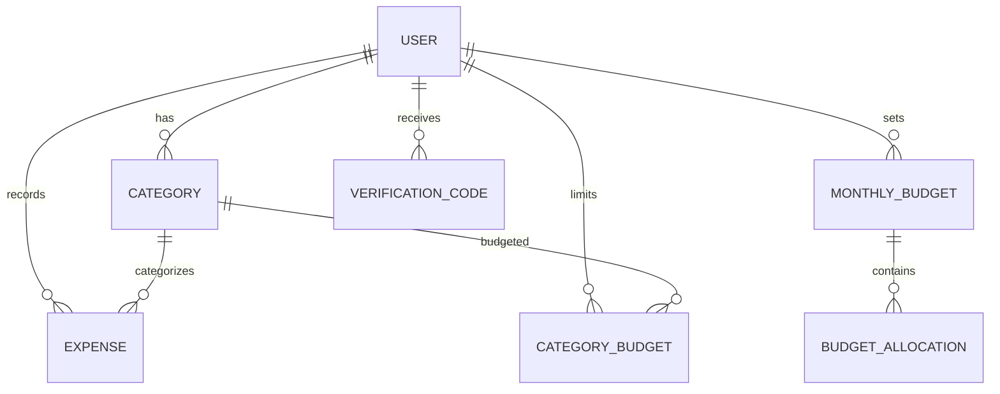

# DB — Agent Reference

> Shared Prisma ORM layer for Supabase PostgreSQL.
> All schema comments, code comments, and variable names MUST be in **English**.

---

## Stack Detail

| Tech | Version | Purpose |
|---|---|---|
| Prisma | 5.14 | Schema definition + migrations + client generation |
| @prisma/client | 5.14 | Runtime database client |
| Supabase PostgreSQL | — | Hosted database with Session Pooler |

---

## Folder Structure

```
packages/db/
├── prisma/
│   └── schema.prisma    → Single source of truth for all models
├── src/
│   ├── index.ts         → Export shared PrismaClient instance
│   └── generated/       → Prisma Client output (auto-generated, DO NOT edit)
├── migrations/          → Manual SQL migration files
└── dist/                → Compiled output (copied from src/ on build)
```

---

## Prisma Schema Overview

### Models

```prisma
User              → id, username (unique), email (unique), password, phoneNumber (unique?), isVerified, role (ADMIN|USER), createdAt
Category          → id, userId, name, color, icon, isDefault, year, month, expenses[], budgets[]
Expense           → id, userId, categoryId, amount (Int), date, note?, createdAt
VerificationCode  → id, userId, code, expiresAt, used, createdAt
MonthlyBudget     → id, userId, year, month, startingBalance (Int), allocations[]
BudgetAllocation  → id, budgetId, label, amount (Int), order
CategoryBudget    → id, userId, categoryId, year, month, amount (Int)
```

### Unique Constraints
- `User.username`, `User.email`
- `User.phoneNumber` (nullable unique)
- `Category`: `@@unique([userId, name, year, month])`
- `MonthlyBudget`: `@@unique([userId, year, month])`
- `CategoryBudget`: `@@unique([userId, categoryId, year, month])`

### Relations
```
User 1 —* Category
User 1 —* Expense
User 1 —* MonthlyBudget
User 1 —* CategoryBudget
User 1 —* VerificationCode

Category 1 —* Expense
Category 1 —* CategoryBudget

MonthlyBudget 1 —* BudgetAllocation
```

---

## ER Diagram (Mermaid)



---

## Connection Strategy

- **Primary**: Supabase **Session Pooler** (`aws-1-ap-northeast-1.pooler.supabase.com:5432`)
  - IPv4-compatible, free-tier friendly.
  - Use this for `DATABASE_URL`.
- **Direct**: Supabase direct connection string for `DIRECT_URL`.
  - Required by Prisma for migrations.
  - May be IPv6-only on free tier; use Session Pooler for runtime.

---

## Migration Workflow

**Important**: Do NOT use `prisma db push` on production Supabase (IPv4 block on free tier).

1. Edit `prisma/schema.prisma`
2. Generate migration SQL locally:
   ```bash
   npx prisma migrate diff --from-empty --to-schema-datamodel prisma/schema.prisma > migrations/my_migration.sql
   ```
3. Run SQL manually via **Supabase SQL Editor**.
4. Generate client:
   ```bash
   pnpm generate
   ```
   ⚠️ **Stop the web dev server first** to avoid lock-file conflicts.

---

## Dev Commands

```bash
pnpm generate     # prisma generate
pnpm build        # generate + tsc + copy generated to dist/
pnpm db:push      # prisma db push (local dev only, NOT for Supabase production)
pnpm studio       # Prisma Studio GUI
```

---

## Environment Variables

| Variable | Required | Description |
|---|---|---|
| `DATABASE_URL` | Yes | Session Pooler connection string |
| `DIRECT_URL` | Yes | Direct connection string |

---

## Shared Package Export

`packages/db/src/index.ts` exports a singleton `PrismaClient` instance:

```ts
import { PrismaClient } from "./generated/prisma-client";
export const prisma = new PrismaClient();
```

Both `web` and `bot` import via:
```ts
import { prisma } from "@finance/db";
```

`tsconfig-paths` (bot) and Next.js `transpilePackages` (web) resolve this workspace import.

---

## Important Notes

- **Never edit `src/generated/` manually** — it is overwritten on `prisma generate`.
- **Prisma binary targets** in schema include `native`, `linux-musl-openssl-3.0.x`, `debian-openssl-3.0.x`, `rhel-openssl-3.0.x` for cross-platform builds (Railway).
- **Always run `prisma generate` after schema changes** and before restarting dependent services.
